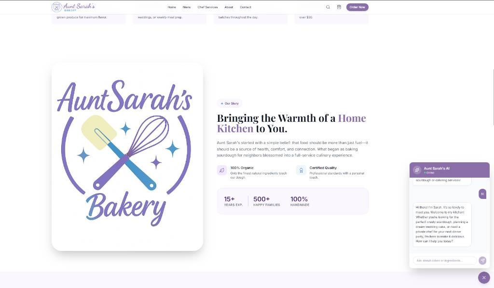

# Aunt Sarah's Bakery & Chef Services



Aunt Sarah's Bakery is an artisanal platform designed to bring the warmth of a home kitchen directly to you. This project features a modern React-based frontend and a secure serverless backend, integrating Google Gemini AI to provide a personalized culinary experience.

## 🚀 Key Features

### 🍰 Artisanal Menu
Explore our handcrafted selection of sourdough breads, custom cakes, and seasonal baked goods. Each item is made with 100% organic ingredients and professional standards.

### 👨‍🍳 Private Chef Services
Beyond baking, we offer exclusive private chef experiences for weddings, events, or luxury meal prepping, tailored to your specific culinary needs.

### 🤖 "Aunt Sarah" AI Assistant
Meet "Aunt Sarah," our AI culinary companion powered by Google Gemini 1.5 Flash. Sarah can:
- Recommend the perfect crusty sourdough for your dinner party.
- Help you plan a dream wedding cake design.
- Answer questions about ingredients and organic sourcing.
- Assist with order inquiries and scheduling private chef services.

### 🔐 Secure Architecture
- **Serverless Backend**: A secure proxy handles all AI requests, ensuring API credentials never reach the client.
- **Privacy First**: Chat history remains anonymous and is only kept in-memory to protect user data.


## 🛠️ Tech Stack

- **Frontend**: React 19, TypeScript, Vite, Tailwind CSS
- **Icons**: Lucide React
- **AI**: Google Gemini SDK
- **Deployment**: Vercel (recommended for Serverless Functions)

## 🔐 Security & Community Standards

This project adheres to professional security standards:
- **API Protection**: The Gemini API key is never exposed to the client. All AI requests are proxied through a secure `/api/chat` serverless function.
- **Environment Management**: sensitive keys are managed via `.env` files (locally) and Repository Secrets (production).
- **History Privacy**: Chat history is kept in-memory and not logged or stored.

## 💻 Local Development

### Prerequisites
- Node.js (Latest LTS recommended)
- npm

### Installation
1. Clone the repository.
2. Install dependencies:
   ```bash
   npm install
   ```
3. Create a `.env.local` file in the root directory and add your API key:
   ```env
   GEMINI_API_KEY=your_google_ai_studio_key
   ```
4. Start the development server:
   ```bash
   npm run dev
   ```

## 🌐 Deployment

### Deploying to Vercel (Recommended)
1. Push your code to a GitHub repository.
2. Import the repository into the [Vercel Dashboard](https://vercel.com).
3. In **Project Settings > Environment Variables**, add:
   - Key: `GEMINI_API_KEY`
   - Value: `your_actual_api_key`
4. Deploy. Vercel will automatically detect the `/api` directory and host your serverless functions.

## 📄 License

This project is private and intended for internal use.
